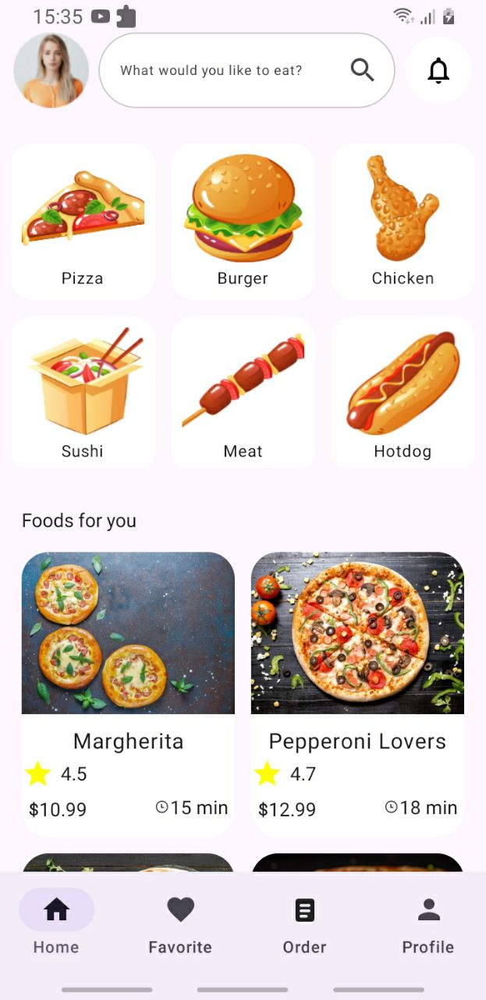
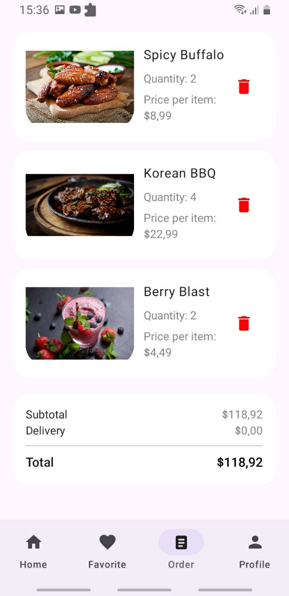
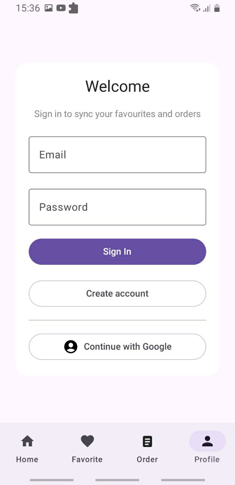

# FoodApp 

FoodApp is a modern Android application built with Jetpack Compose that lets users explore dishes, manage favourites, and place orders with seamless Firebase Authentication (email/password and Google Sign-In).

## Table of Contents

1. [Features](#features)
2. [UI Preview](#ui-preview)
3. [Architecture & Tech Stack](#architecture--tech-stack)
4. [Getting Started](#getting-started)
    - [Prerequisites](#prerequisites)
    - [Firebase configuration](#firebase-configuration)
    - [Run the project](#run-the-project)
5. [Project Structure](#project-structure)
6. [Roadmap](#roadmap)

## Features

- \u2705 Browse curated food listings with detail pages per dish.
- \u2705 Manage personal favourites and orders with per-user state persistence.
- \u2705 Firebase Authentication with email/password and Google Sign-In flows, including validation and rich UI feedback.
- \u2705 Offline-friendly in-memory caching for favourites and orders per account session.
- \u2705 Modern, responsive UI implemented entirely with Jetpack Compose.

## UI Preview

| Home | Detail | Favourite |
| ---- | ------ | --------- |
|  |  |  |

| Order | Profile |
| ----- | ------- |
|  |  |

## Architecture & Tech Stack

- **Language**: Kotlin
- **UI**: Jetpack Compose, Material 3
- **State Management**: ViewModel + StateFlow
- **Networking**: Retrofit (API data access layer)
- **Authentication**: Firebase Auth (Email/Password & Google Sign-In)
- **Coroutines**: Kotlin coroutines for asynchronous flows

## Getting Started

### Prerequisites

- Android Studio Giraffe (or newer) with Android SDK 34+
- JDK 17+
- Firebase project with Authentication enabled

### Firebase configuration

1. Enable Email/Password and Google providers in the **Firebase Console** > Authentication.
2. Download the `google-services.json` file from **Project settings** > **General** and place it inside the `app/` module directory.
3. Copy the **Web client ID** from **Project settings** > **General** > **Web API Key & Web clients** and paste it into `app/src/main/res/values/strings.xml` under `default_web_client_id`.

### Run the project

```bash
./gradlew assembleDebug
```

Or open the project in Android Studio and press **Run**.

Firebase authentication flows will be available immediately after the configuration steps above.

## Project Structure

```
FoodApp/
├── app/
│   ├── src/main/java/com/example/foodapp
│   │   ├── Screen/           # Jetpack Compose screens (Home, Detail, Favourite, Order, Profile)
│   │   ├── Retrofit/         # ViewModels, repository, data models
│   │   └── ...
│   └── src/main/res          # UI resources (strings, themes, etc.)
├── docs/screenshots/         # README image assets
└── README.md
```

## Roadmap

- [ ] Persist favourites and orders via Firestore/Realtime Database.
- [ ] Add push notifications for order status updates.
- [ ] Expand catalogue with categories and search filters.

---

Feel free to open issues or submit pull requests with improvements, bug fixes, or new ideas!
